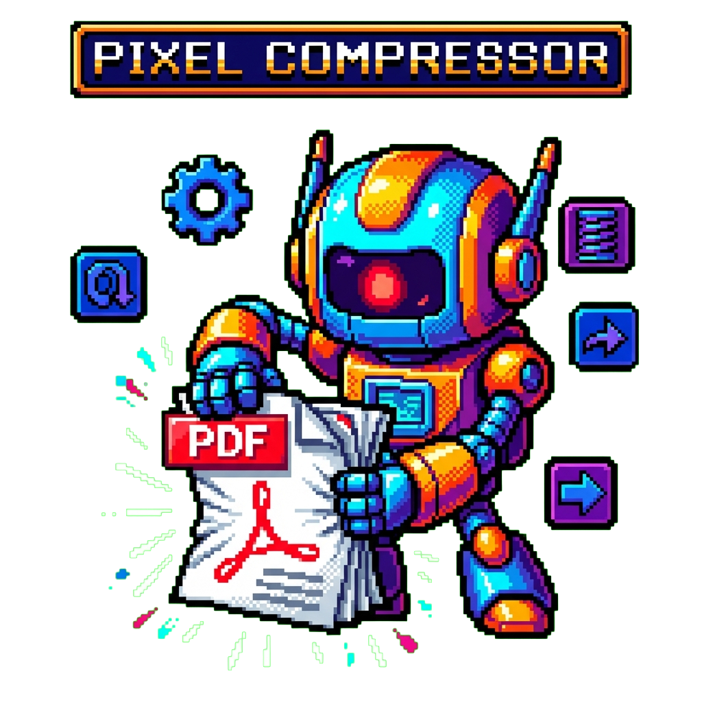

<div align="center">
  

  # pdf-compressor

  [](https://www.python.org/)
  [](https://pypi.org/project/pdf-compressor/)
  [](https://opensource.org/licenses/MIT)
  [](https://www.ghostscript.com/)

  **📄 Compress PDFs by trying multiple strategies and keeping the smallest result ⚡**

  [Installation](#installation) · [Usage](#usage) · [How It Works](#how-it-works)
</div>

## Overview

Different PDFs respond better to different compression methods. Some are already optimized, others are bloated with high-resolution images. This tool eliminates the guesswork by trying multiple compression strategies and keeping the smallest result.

## Features

- **Smart compression** - Tries 3 strategies and picks the best result
- **Batch processing** - Compress multiple files with wildcards (`*.pdf`)
- **Parallel processing** - Compress multiple files concurrently with `-j`
- **Quality presets** - Choose between screen, ebook, printer, or prepress quality
- **Flexible output** - Custom filenames, directories, or in-place replacement
- **Scriptable** - Quiet mode for automation and pipelines

## Installation

### Prerequisites

Install Ghostscript:

```bash
# macOS
brew install ghostscript

# Ubuntu/Debian
apt install ghostscript

# Fedora/RHEL
dnf install ghostscript
```

### Install as global tool (recommended)

```bash
uv tool install git+https://github.com/tsilva/pdf-compressor.git
```

To upgrade later:

```bash
uv tool upgrade pdf-compressor
```

### Install with pip

```bash
pip install git+https://github.com/tsilva/pdf-compressor.git
```

## Usage

```bash
# Compress a single file (creates document.compressed.pdf)
pdf-compressor document.pdf

# Specify output filename
pdf-compressor document.pdf -o small.pdf

# Batch compress multiple files
pdf-compressor *.pdf

# Compress to a specific directory
pdf-compressor *.pdf -d compressed/

# Replace original files (use with caution)
pdf-compressor -i large.pdf

# Use 4 parallel workers for batch compression
pdf-compressor *.pdf -j 4

# Use screen quality (72 DPI) for smallest size
pdf-compressor document.pdf -Q screen

# Quiet mode (no output except errors)
pdf-compressor -q document.pdf
```

### Options

| Option | Description |
|--------|-------------|
| `-o, --output <file>` | Output filename (single file mode only) |
| `-d, --output-dir <dir>` | Output directory for compressed files |
| `-i, --in-place` | Replace original files |
| `-Q, --quality <preset>` | Quality preset: screen, ebook, printer, prepress |
| `-j, --jobs <n>` | Number of parallel jobs (0 = auto) |
| `-q, --quiet` | Suppress output except errors |
| `-v, --version` | Show version |

### Quality Presets

| Preset | DPI | Use Case |
|--------|-----|----------|
| `screen` | 72 | Web viewing, smallest size |
| `ebook` | 150 | E-readers and tablets (default) |
| `printer` | 300 | Office printing |
| `prepress` | 300 | Professional printing |

## How It Works

The tool tries three compression strategies and keeps the smallest result:

| Strategy | Method | Best For |
|----------|--------|----------|
| **pikepdf** | Linearizes and optimizes PDF object streams | Already-optimized PDFs |
| **Ghostscript** | Aggressive image downsampling | Image-heavy PDFs |
| **Combined** | Ghostscript followed by pikepdf optimization | Mixed content |

If none of the strategies produce a smaller file, the original is preserved.

## Example Results

| PDF Type | Original | Compressed | Reduction |
|----------|----------|------------|-----------|
| Scanned document | 434 KB | 38 KB | 91% |
| Digital form | 164 KB | 96 KB | 41% |
| Invoice | 32 KB | 21 KB | 33% |

Results vary depending on PDF content. Image-heavy PDFs typically see the largest reductions.

## Contributing

Found a bug or have a suggestion? Please open an issue:

[GitHub Issues](https://github.com/tsilva/pdf-compressor/issues)

## License

MIT License - see [LICENSE](LICENSE) for details.

## Author

**Tiago Silva** - [@tsilva](https://github.com/tsilva)
